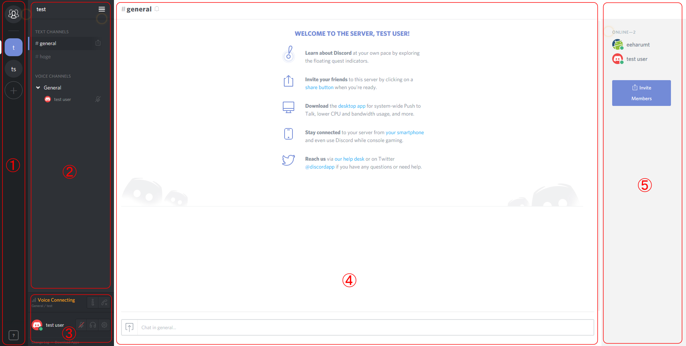
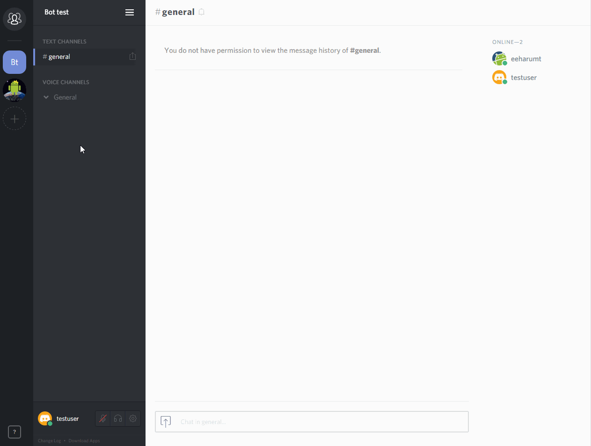

# 基本操作

## 基本画面<!--basic-->



1.  **サーバー／DMエリア**<br>
  サーバーへの参加、およびサーバーの作成
2.  **チャンネルエリア**<br>
  チャンネルへの参加及びチャンネル、サーバ設定など
3.  **ユーザー設定エリア**<br>
  ボイス設定、ユーザー設定など
4.  **テキストチャットエリア**<br>
  テキストチャットの閲覧、投稿)
5.  **サーバーメンバーエリア**<br>
  サーバーメンバー一覧/役職一覧

## サーバへの参加<!--Join-server-->

サーバへ参加するには以下のような招待コードが必要になる。URL形式の招待コードはWebブラウザを用いた参加（ブラウザ版Discord）が可能。

```
https://discord.gg/hogehoge  
hogehoge
```

参加したいサーバの招待コードを受け取ったら、サーバー／DMエリアの＋ボタンをクリックして"サーバーへ参加"をクリックすると、コードの入力欄が表れるので、コードを入力し、参加をクリックすればサーバーへ参加できる。


## チャンネルへの参加<!--Join-channel-->

チャンネルへ参加するときはテキストチャンネル、ボイスチャンネル共にチャンネル名を **クリック** すればチャンネルに参加できる。

> _**チャンネルについて**_<br>
> Discord のチャンネルにはテキストチャンネルとボイスチャンネルがあり、これら2つのチャンネルは独立している。(Teamspeak,Skypeとは異なる) よって、ボイスチャンネルを移動しなくても違うテキストチャンネルのテキストチャットを見たり、投稿したりすることが可能。

## テキストチャットの投稿<!--Edit-chat-->
Discord のチャットにはテキストの装飾、画像・動画ファイルの埋め込みや、Webサイトリンク先情報の表示などといった機能がある。
なお、埋め込まれたメディアが10MB以上の場合プレビューされない。

### テキストの装飾<!--Decoration-->
DiscordのチャットはMarkdown記法を用いた装飾が可能。

-   _斜体_ = `*斜体*`
-   **太字** = `**太字**`
-   **_太字＋斜体_** = `***斜体+斜体***`
-   ~~打ち消し~~ = `~~斜体~~`
-   <u>下線</u>

    = `__下線__`
-   <u>
      <em>下線＋斜体</em>
    </u>

    = `__*下線＋斜体*__`
-   <u>
      <strong>下線＋太字</strong>
    </u>

    = `__**下線＋太字**__`
-   <u>
      <strong>
        <em>下線＋太字+斜体</em>
      </strong>
    </u>

    = `__***下線＋太字+斜体***__`
-   `コードブロック` = `` `コードブロック` ``

```
  複数行
  コード
  ブロック
```

  ↓

````
  ```
  複数行
  コード
  ブロック
  ```
````

### 💻絵文字📱<!--emoji-->
絵文字に割り当てられているコードを入力することで投稿後テキストに絵文字を追加できる。
なお、投稿欄の右側にある絵文字をクリックすると、絵文字選択画面が出現し簡単にテキストに絵文字を追加することが可能。

### ファイルの添付<!-- add files -->
投稿欄の左にあるアイコンをクリックすると、ファイル選択画面が現れ、
画像などをテキストチャットに投稿することができる。
同様の操作がDiscordのアプリケーションへファイルをドラッグ・アンド・ドロップすることでも可能。

## サーバーから退出する<!-- leaveserver -->
サーバーから退出するには、退出したいサーバーのアイコンを右クリックするか、チャンネルエリアの一番上にあるサーバー名をクリックし"サーバーから退出"をクリックすることで退出できる。<br>
**サーバーから退出するともう一度、そのサーバーの招待コードを入力しない限りサーバーへ参加できません。**

## サーバーの作成<!-- Create-server -->
サーバーを作成するには参加と同じく＋ボタンから行うことができる。"サーバーを作成"をクリックすると

-   サーバー名
-   サーバーの設置場所
-   サーバーのアイコン

をそれぞれ設定するウィンドウが現れるので、それぞれ設定した後、"新規作成"をクリックすることでサーバーを作成できる。


