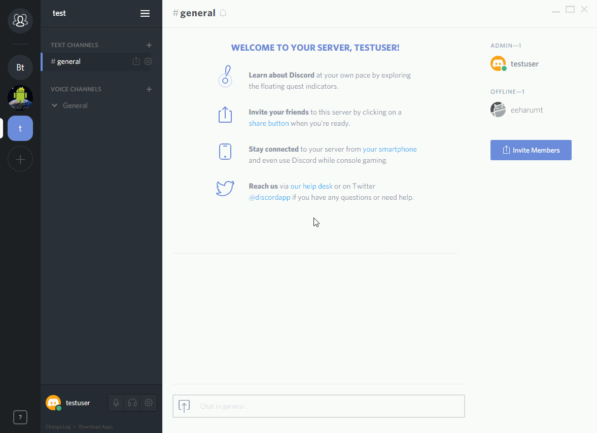

# ユーザー設定

ユーザーに関する設定

_ユーザー設定の開き方_ 

## アカウント(account)

ユーザー名、メールアドレス、ユーザーアイコン及びパスワードの変更ができる。それぞれ変更するには現在使用しているパスワードが必要。

## 接続(Connections)

Discord と連携したいサービスの設定ができる。アイコンをクリックすると連携するためのWebサイトが開かれる。

## フレンド(Friends)
フレンド追加の許可の設定ができる。

## テキスト・画像(Text&Image)

- **DISPLAY IMAGES, VIDEOS, AND LOLCATS**

  - When posted as link to chat. 
    画像、動画リンクが張られたときにチャット内で表示するかどうか
  - When uploade directly to Discord. 
    Discord に直接アップロードした5MB以内の画像、動画を表示するかどうか

- **LINK PREVIEW** 
  チャット内に張られたリンクのリンク先をプレビューするかどうか
- **TEXT-TO-SPEECH** 
  /tts コマンドが使用されたチャットを読み上げるかどうか

## Voice(音声)

- **Basic**

  - INPUT DEVICE / OUTPUT DEVICE 
    入力デバイス及び出力デバイスを選択および音量を調整することができる
  - INPUT MODE 
    Voice Activity (あるマイク音量以上になったときにマイクON)モードか、Push to Talk(特定のボタンをおした時マイクON)モードの選択
  - INPUT SENSITIVITY 
    Voice Activityモードの時の音量検出限界値の設定

- **Advanced**

  - VOICE PROCESSING

  - Echo Cancellation 
    エコー除去

  - Noise Suppression 
    ノイズ除去
  - Automatic Gain Control 
    マイク音量の自動調整

  - ATTENUATION 
    誰かがDiscord で話している時に他のアプリケーションの音量を下げる機能。0％のとき無効。 

## 通知(Notifications)

通知に関する設定

- **DESKTOP NOTIFICATION** 
  デスクトップ通知する条件

  - For activity of any kind (すべて)
  - Only for @mentions (@ユーザー名のみ)
  - Never (デスクトップ通知しない)

- **TEXT-TO-SPEECH** 
  テキストトゥスピーチを行う条件

  - For all channels (すべてのチャンネル)
  - For current selected channels (現在選択しているチャンネル)
  - Never (テキストトゥスピーチを行わない)

- **SOUNDS** 通知音を鳴らす条件

  - Message (メッセージ投稿)
  - Deafen (スピーカーミュートON)
  - Undefen (スピーカーミュートOFF)
  - Mute (マイクミュートON)
  - Unmute (マイクミュートOFF)
  - Connection Lost (コネクションロスト)
  - PTT Active (プッシュトゥトークのマイクON)
  - PTT Deactive (プッシュトゥトークのマイクOFF)
  - User Join (ユーザー参加)
  - User Leave (ユーザー退出)

## キー割り当て(Keybinds)

Add a Keybindのボタンを押すことによってキーコンフィグの設定を行うことができる。 
設定できる機能は以下の通り。

- Push to Talk 
  キーを押している間だけマイクON
- Push to Mute 
  キーを押している間だけマイクOFF
- Toggle Mute 
  キーを押すたびにマイクミュートのON、OFF切り替え
- Toggle Deafen 
  キーを押すたびにスピーカーミュートのON、OFF切り替え

## テーマ(Appearance)

- **THEME**

  - Light (明るいテーマ)
  - Dark (暗いテーマ)

- **MESSAGE DISPLAY**

  - Cozy (チャットに投稿者のアイコンを表示する)
  - Compact (ユーザー名と投稿内容にみ表示する)

## ゲーム(Games)

- **GAME ACTIVITY**

- Display currently running game as a status message. 
実行しているゲームをステータスとして表示するかどうか

## オーバーレイ(Overlay)

## 言語設定(Locale)

- **LANGUAGE** 
  言語選択

  - 英語 (English, USA)
  - オランダ語 (Nederlands)
  - ドイツ語 (Deutsch)
  - フランス語 (Francais)
  - 中国語 (繁體中文)
  - ポーランド語 (Polski)
  - ポルトガル語 (português do brasil)
  - ロシア語 (русский)
  - スペイン語 (Español)
  - スウェーデン語 (Svenska)

## 配信モード(Streamer Mode)

## セキュリティ(Security)
