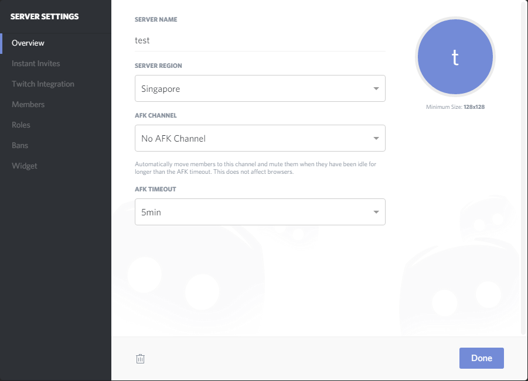
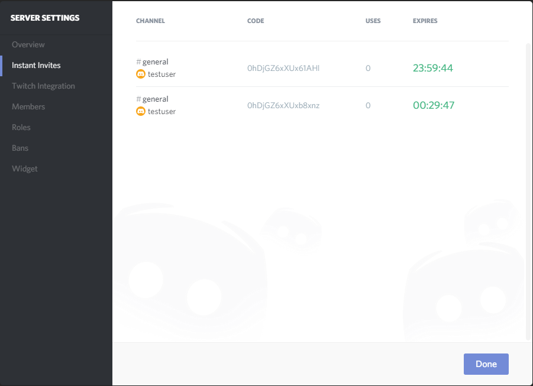
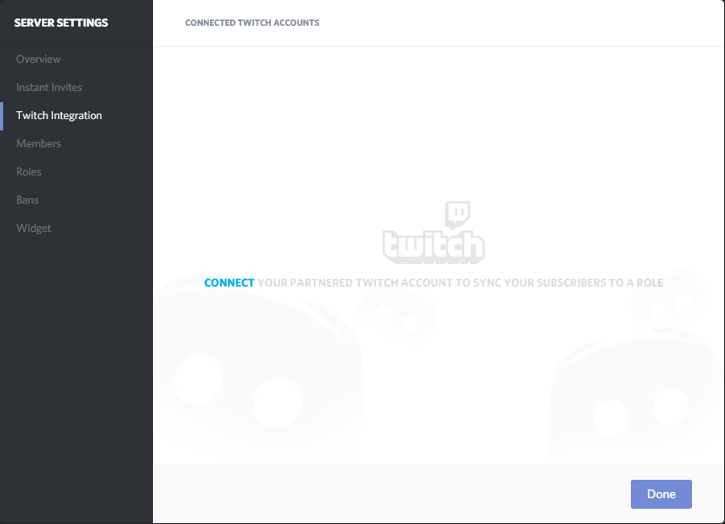
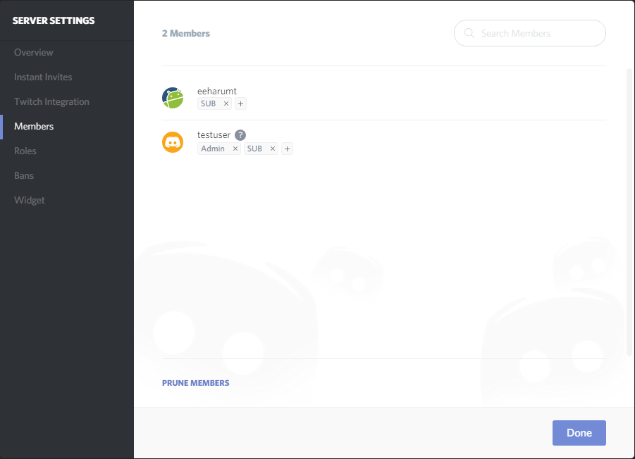
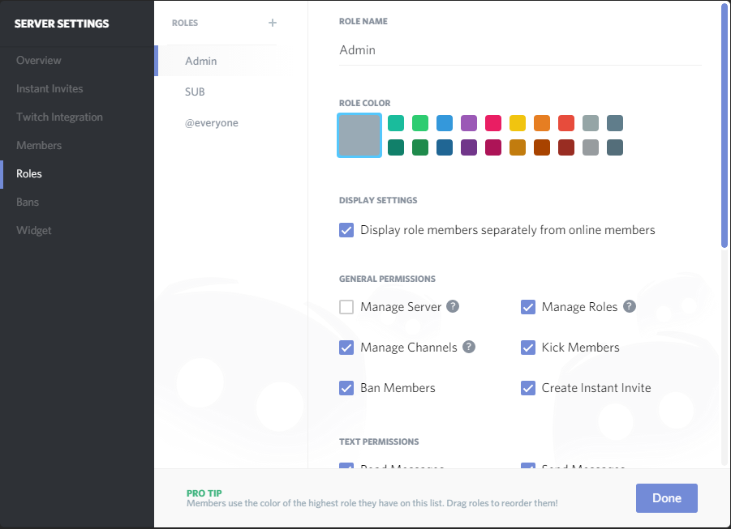
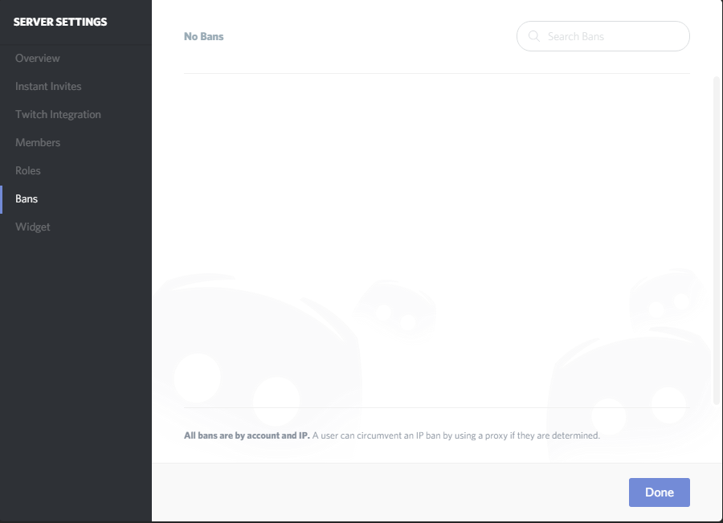
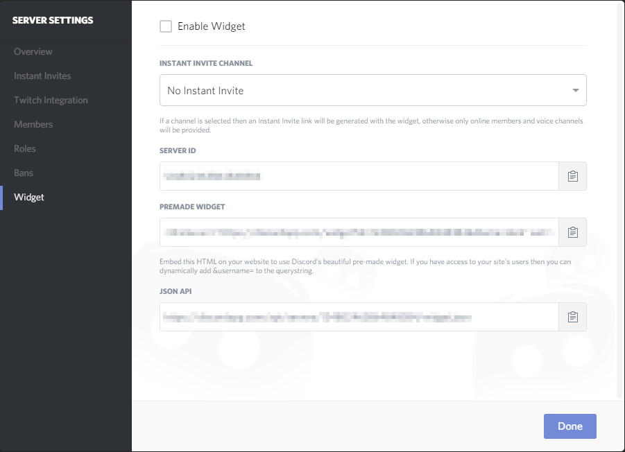

# サーバー設定

サーバーに関する設定

_サーバー設定の開き方_ 

## 概要(Overview)

- **SERVER NAME** 
  サーバー名
- **SERVER REGION** 
  サーバー設置場所
- **AFK CHANNEL** 
  AFK:Away From Keyboard(離席)チャンネルをどのチャンネルに設定するか
- **AFK TIMEOUT** 
  何分以上アイドル時間が続けばAFKチャンネルに移動するか

## 招待(Instant Invite)

招待コードの管理画面。どの招待コードがどのチャンネルで誰が作り、何回使われたかあとどれぐらいその招待コードが有効かが表示される。表示されている招待コードにマウスオーバーすると表示される"Revoke"を押すことでその招待コードを削除し無効にできる。

## 連携サービス(Integration)

？

## メンバー(Members)

サーバーに参加したメンバーの一覧。Rolesで設定した役職を割り当てることができる。

## 役職(Roles)

役職(権限を持ったグループ)の設定。ROLESの横にある＋ボタンを押すことで新しい役職を作成できる。

- **ROLE NAME** 
  役職名
- **ROLE COLOR** 
  役職の色(表示されるユーザー名の色)
- **DISPLAY SETTINGS** 
  役職を表示するかどうか
- **GENERAL PERMISSIONS** 
  総合的な権限設定
- **TEXT PERMISSIONS** 
  テキストチャンネルの権限設定
- **VOICE PERMISSIONS** 
  ボイスチャンネルの権限設定

## バンしたユーザー(Bans)

Ban(追放)したユーザーのリスト。このリストから消さない限りそのユーザーはサーバーに参加することができない。 また、BanはユーザーアカウントとIPアドレスをもとに行われる。

## 絵文字(Emoji)

## ウィジェット(Widget)

ウェブサイトに埋め込めるウィジェットを生成できる。

## Webhooks
Webhookの設定

## セキュリティ(Security)
二段階認証システムの設定
